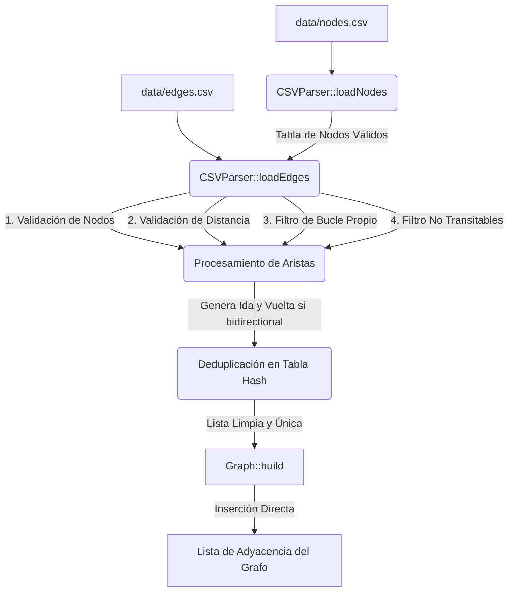

# Análisis de la Red Vial de Bolivia — Rutas Óptimas

**Integrantes:**
- Alejandro Castro
- Sebastián Arce

Este proyecto implementa una herramienta de análisis y optimización de redes viales en C++ utilizando datos reales de OpenStreetMap (nodos y aristas de Bolivia). A través de una arquitectura optimizada y algoritmos de teoría de grafos, permite realizar análisis estructurales y de ruteo eficiente sobre millones de elementos en cuestión de milisegundos.

---

## 🛠️ Arquitectura y Flujo de Datos

El diseño del sistema separa estrictamente la fase de **carga/limpieza de datos** de la fase de **representación del grafo**, logrando un alto rendimiento en la ejecución de algoritmos.



### 1. Limpieza y Procesamiento (`CSVParser`)
La carga de datos está optimizada para procesar archivos de gran tamaño (decenas de megabytes) en segundos:
* **Lectura en bloque**: Lee los archivos CSV completos en memoria en un buffer de caracteres para evitar la latencia de lecturas fragmentadas.
* **Conversión rápida (`std::from_chars`)**: Reemplaza `std::stod`/`std::stoi` con funciones C++17 de bajo nivel sin asignaciones extra de memoria.
* **Limpieza de Datos**:
  1. **Validación de nodos**: Las aristas con referencias a IDs inexistentes son filtradas.
  2. **Validación de distancias**: Se ignoran aristas con pesos de distancia menores o iguales a `0` o infinitos.
  3. **Filtro de bucles propios**: Se eliminan enlaces donde el origen y el destino son el mismo nodo (`from_id == to_id`).
  4. **Filtro de vías no transitables**: Se remueven rutas peatonales o ciclovías (`footway`, `path`, `steps`, `pedestrian`, `cycleway`, `bridleway`) para enfocar el análisis en vehículos.
* **Generación de Sentidos y Deduplicación Temprana**:
  * Para calles bidireccionales (`oneway = false`), el parser genera automáticamente la arista de ida (`from_id -> to_id`) y la de retorno (`to_id -> from_id`).
  * Utiliza una tabla hash interna (`std::unordered_map`) con una clave combinada de 64 bits `(from_id << 32) | to_id`. Si detecta una arista duplicada en la misma dirección, **conserva únicamente la que posea la menor distancia física**, registrándolo en las estadísticas.

### 2. Construcción del Grafo (`Graph::build`)
Gracias a la deduplicación temprana en el parser, el constructor del grafo es un **cargador directo y sumamente rápido**:
* Reserva la memoria exacta para el vector de adyacencias basándose en el ID máximo detectado.
* Inserta las aristas del parser secuencialmente en el vector de adyacencia de cada nodo.
* **No realiza filtros ni deduplicaciones en caliente**, reduciendo drásticamente el uso de CPU y memoria durante la instanciación.

### 3. Estimación del Tiempo de Viaje
Para las aristas, además de la distancia en metros (`weight`), se computa un peso de tiempo (`time_weight`) en segundos:
* Se lee el límite de velocidad (`maxspeed`) del archivo.
* Si el límite es desconocido (`0`), se infiere basándose en la clasificación de la vía (`fclass`):
  * Autopistas (`motorway`): 100 km/h
  * Troncales (`trunk`): 80 km/h
  * Primarias (`primary`): 60 km/h
  * Secundarias (`secondary`): 50 km/h
  * Terciarias (`tertiary`): 40 km/h
  * Residenciales (`residential`): 30 km/h
  * Caminos rurales (`track` / `path`): 10 km/h
  * Otros/Por defecto: 20 km/h
* El tiempo se calcula dividiendo la distancia por la velocidad convertida a metros por segundo ($v_{m/s} = v_{km/h} \times \frac{1000}{3600}$).

---

## 🧮 Algoritmos Implementados y Criterio de Selección

### 1. Alcance de Vehículos (`vehicleReach`)
* **Propósito**: Contar cuántos nodos son alcanzables en vehículo dentro de un radio de 5 km desde un origen.
* **Algoritmo**: **Dijkstra** modificado.
* **Por qué se eligió**: Como los pesos de las aristas son positivos (distancias físicas en metros), Dijkstra es el algoritmo óptimo de fuente única de camino más corto (SSSP). Se optimiza deteniendo la búsqueda inmediatamente cuando la distancia acumulada en la cola de prioridad supera los 5000 metros (poda del espacio de búsqueda).

### 2. Componentes Conexas (`weaklyConnectedComponents`)
* **Propósito**: Identificar todas las "islas" (componentes débilmente conexas) de la red vial e identificar el componente gigante (el continente principal).
* **Algoritmo**: **Recorrido bidireccional (BFS/DFS) sobre grafo y transpuesta**.
* **Por qué se eligió**: Dado que el grafo vial es dirigido, determinar componentes débilmente conexas requiere tratar las aristas como no dirigidas. En lugar de cambiar la estructura del grafo, el algoritmo crea dinámicamente un mapeo de aristas transpuestas (inversas). Con un DFS recursivo o iterativo clásico que explora tanto los vecinos directos como los inversos, se agrupan todos los nodos conectados en complejidad lineal $\mathcal{O}(V + E)$.

### 3. Diámetro Vial (`roadDiameter`)
* **Propósito**: Encontrar la distancia del camino más largo posible entre dos puntos transitables dentro del componente gigante.
* **Algoritmo**: **Heurística de Doble Barrido de Dijkstra (Double-sweep)**.
* **Por qué se eligió**: Calcular el diámetro exacto de un grafo requiere resolver el problema de caminos más cortos para todos los pares (APSP), lo cual tiene una complejidad de $\mathcal{O}(V^3)$ o $\mathcal{O}(V^2 \log V + VE)$. Con casi 900,000 nodos, esto es inviable en tiempo real. 
  La heurística de doble barrido resuelve el problema de forma aproximada y rápida:
  1. Selecciona un nodo inicial aleatorio en la componente gigante.
  2. Ejecuta un Dijkstra de fuente única para encontrar el nodo $u$ más lejano.
  3. Ejecuta un segundo Dijkstra de fuente única desde $u$ para hallar el nodo $w$ más alejado de él.
  La distancia entre $u$ y $w$ ofrece una estimación de diámetro extremadamente precisa y se ejecuta en solo $\mathcal{O}(V \log V + E)$.

### 4. Árbol de Expansión Mínima (`minimumSpanningTree`)
* **Propósito**: Encontrar la infraestructura mínima necesaria en kilómetros para interconectar todos los nodos del componente gigante (clave en escenarios de emergencias o tendido de cables).
* **Algoritmo**: **Kruskal con Estructura de Conjuntos Disjuntos (Union-Find)**.
* **Por qué se eligió**: El algoritmo de Kruskal es excelente para grafos dispersos. Extrae todas las aristas únicas del componente gigante, las ordena por peso de forma ascendente y las procesa una por una. La estructura de **Union-Find con optimización de compresión de caminos** permite unir conjuntos e identificar ciclos en tiempo casi constante $\mathcal{O}(\alpha(V))$. Esto hace que la complejidad total esté dominada únicamente por el ordenamiento de las aristas: $\mathcal{O}(E \log E)$, lo que se ejecuta en milisegundos.

### 5. Comparación de Rutas (`compareRoutes`)
* **Propósito**: Comparar y contrastar la ruta óptima por distancia física frente a la ruta óptima en tiempo estimado entre dos ubicaciones.
* **Algoritmo**: **Dijkstra Doble con Reconstrucción de Caminos**.
* **Por qué se eligió**: Se ejecutan dos búsquedas independientes de Dijkstra: la primera asignando pesos por distancia en metros (`weight`) y la segunda usando segundos (`time_weight`). Al finalizar, se reconstruyen los caminos recorriendo los nodos padres en orden inverso para computar la cantidad de intersecciones en común (nodos compartidos), la distancia total y el tiempo estimado para ambas alternativas.

---

## 🚀 Compilación y Ejecución

El proyecto utiliza **CMake** para la configuración y compilación del entorno.

### Requisitos
* Compilador de C++ que soporte el estándar C++17 (GCC 9+, Clang 9+, o MSVC 2019+).
* CMake 3.20 o superior.

### Compilación rápida
Ejecuta los siguientes comandos desde la carpeta raíz del proyecto:
```bash
cmake -B build -S .
cmake --build build
```

### Ejecución
Para iniciar el menú interactivo, ejecuta el binario desde la carpeta de compilación:
```bash
cd build
./rutas-optimas
```
> [!NOTE]
> El programa espera encontrar la carpeta `data/` con los archivos `nodes.csv` y `edges.csv` en el directorio de nivel superior relativo a donde se ejecuta el binario (ej. `../data/nodes.csv`).
